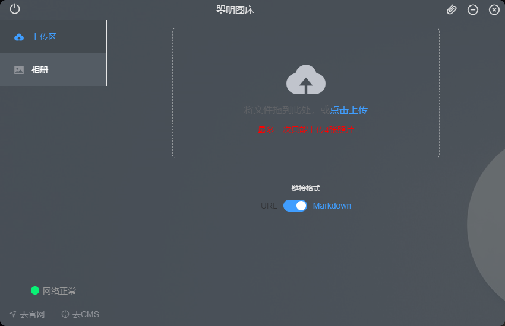
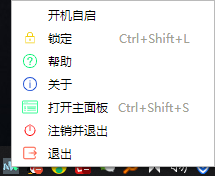

## MKPic
MKPic 是一款使用Electron-Vue所写的一款运行于桌面的个人图传软件
> Author: ZhaoMing
### 下载安装运行指南
> 提示:  安装要求宿主机上必须要安装有Node,最好是8.x以及上上.
```shell
# 使用git工具克隆项目到本地
git clone https://github.com/GoogleMT/electron-pic.git  
# 进进入到项目中运行如下命令
cd ./electron-pic
npm i && npm run dev
```
项目就能正常运行起来了.

### 功能实现
+ 1.实现了登录上传,在没有登录的情况下不能进去到上传页面
+ 2.文件点击文件和拖拽上传文件
+ 3.全局键盘监听, 离开防止别人操作`Ctrl+Shift+L`进行上锁, 以及快速呼出界面`Ctrl+Shift+L`
+ 4.设置是否开机自启动
+ 5.图片的地址点击复制和删除图片
+ 6.全局的离线监听,如果离线上传操作自动反弹
+ 7.全局的窗口置顶操作,不让窗口被其它窗口覆盖

### 我的开发环境
> 以下是我的开发环境 如果项目不能正常运行可以对比借鉴一下
```shell
node                       v12.13.0
npm                        v6.12.0
webpack                    v4.15.1
vue-cli                    v3.8.2
vue                        v2.5.16
System                     Window 10
```
### 一些第三方库的使用

+ 1.`axios`作为ajax的http请求库
+ 2.`element-ui`用户快熟的布局
+ 3.`mousetrap`用于一些键盘事件的监听
+ 4.`md5`用于加密密码和用户标示进行密文传输

### 项目运行效果展示

> 登录界面


> 上传图片界面



> 图片操作面板


> 右下角托盘图标



### 鸣谢
灵感来源于图床软件PicGo
感谢一直默默支持我的所有人